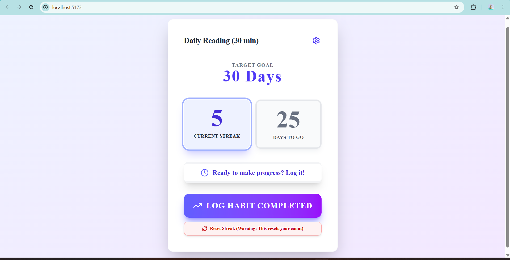

# StreakFlow: Simple Habit Tracker
StreakFlow is a clean, modern, and minimal single-page application built with React and styled using Tailwind CSS. It focuses on the core concept of habit tracking: setting a goal streak and logging daily completion to maintain momentum.

## Features
Customizable Habit: Easily name your habit and set a specific target streak (in days).

Daily Logging: A large, prominent button to log completion for the current day, which becomes disabled once complete.

Streak Visualization: Clear display of the Current Streak and Days To Go until the target is met.

Goal Recognition: Visual feedback (color change to green and special messages) when the target streak is achieved.

Setup/Edit Page: Dedicated page to modify the habit name and target at any time.

Reset Functionality: Option to reset the current streak back to zero.

Responsive & Aesthetic Design: Utilizes dynamic gradients and shadows for a modern, eye-pleasing aesthetic.

## 🖼️ Application Screenshot

## 🛠️ Technology Stack
Frontend Framework: React

Styling: Tailwind CSS (for utility-first styling and rapid development)

Icons: Lucide React

## Contact 

For any inquiries or feedback, please contact:

### Utkarsha Shende

📧 [utkarshapd1403@gmail.com]
